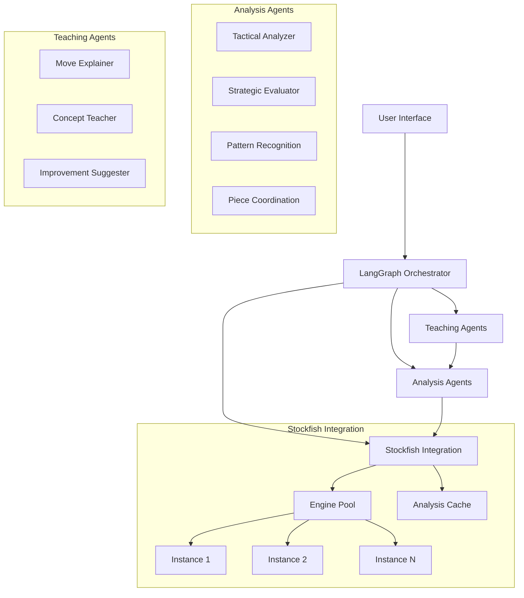
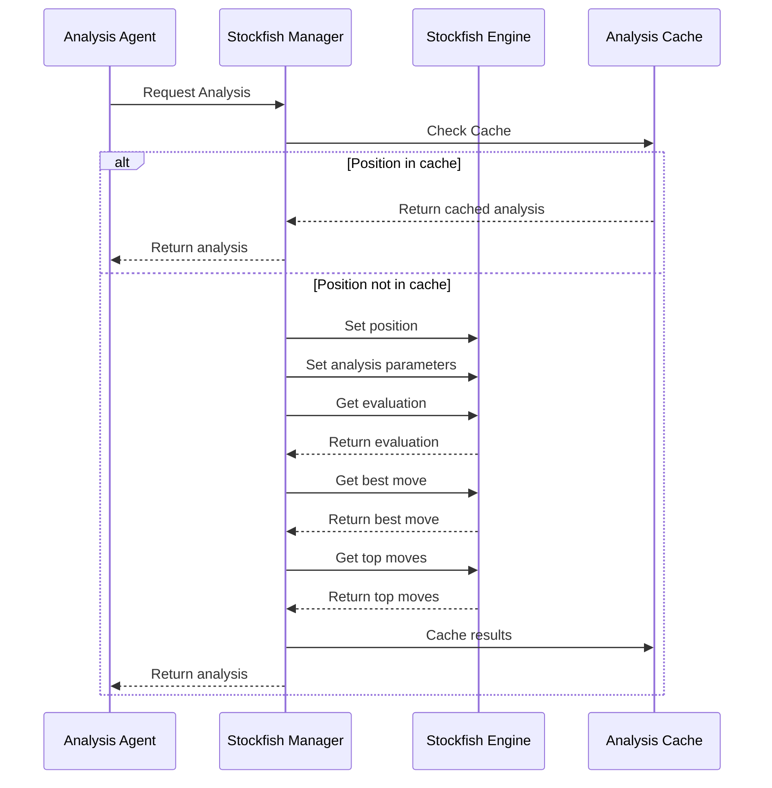
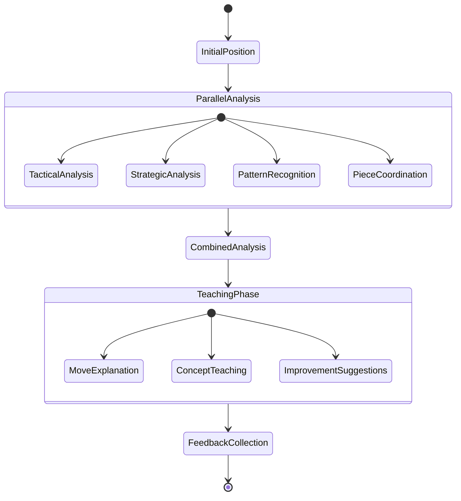

# Chess Tutor AI - Architectural Design Document

## 1. System Overview

The Chess Tutor AI is an intelligent teaching system that uses multiple specialized agents to analyze chess positions and provide instruction. Built with Pydantic-ai for structured AI interactions and LangGraph for agent orchestration, the system creates a comprehensive understanding of chess positions through multi-agent collaboration.

## 2. Core Architecture



## 3. Agent Specifications

### 3.1 Analysis Agents (Pydantic-ai Models)

```python
from pydantic_ai import AIModel, Field, LLMFunction

class TacticalAnalyzer(AIModel):
    """Agent responsible for tactical analysis"""
    position_fen: str = Field(..., description="FEN notation of the position")

    @LLMFunction
    def find_tactical_motifs(self) -> list[dict]:
        """Identify tactical themes and combinations"""

    @LLMFunction
    def calculate_critical_lines(self) -> list[dict]:
        """Calculate tactically critical variations"""

class StrategicEvaluator(AIModel):
    """Agent responsible for strategic evaluation"""
    position_fen: str = Field(..., description="FEN notation of the position")

    @LLMFunction
    def evaluate_pawn_structure(self) -> dict:
        """Analyze pawn structure and its implications"""

    @LLMFunction
    def assess_piece_placement(self) -> dict:
        """Evaluate piece placement and coordination"""

    @LLMFunction
    def identify_plans(self) -> list[dict]:
        """Identify strategic plans for both sides"""

class PatternRecognitionAgent(AIModel):
    """Agent for recognizing common patterns"""
    position_fen: str = Field(..., description="FEN notation of the position")

    @LLMFunction
    def identify_similar_positions(self) -> list[dict]:
        """Find similar historical positions"""

    @LLMFunction
    def suggest_typical_plans(self) -> list[dict]:
        """Suggest plans based on recognized patterns"""

class PieceCoordinationAgent(AIModel):
    """Agent for analyzing piece coordination"""
    position_fen: str = Field(..., description="FEN notation of the position")

    @LLMFunction
    def analyze_piece_synergy(self) -> dict:
        """Analyze how pieces work together"""

    @LLMFunction
    def find_improvement_spots(self) -> list[dict]:
        """Identify pieces that could be better placed"""
```

### 3.2 Teaching Agents (Pydantic-ai Models)

```python
class MoveExplainer(AIModel):
    """Agent for explaining moves"""
    move_uci: str
    position_analysis: dict = Field(..., description="Combined analysis from other agents")

    @LLMFunction
    def explain_move_reasoning(self) -> str:
        """Generate comprehensive move explanation"""

    @LLMFunction
    def suggest_alternatives(self) -> list[dict]:
        """Suggest and explain alternative moves"""

class ConceptTeacher(AIModel):
    """Agent for teaching chess concepts"""
    position_analysis: dict

    @LLMFunction
    def extract_teaching_points(self) -> list[dict]:
        """Extract key concepts for teaching"""

    @LLMFunction
    def generate_exercises(self) -> list[dict]:
        """Generate related exercises for practice"""

class ImprovementSuggester(AIModel):
    """Agent for suggesting improvements"""
    game_analysis: dict

    @LLMFunction
    def suggest_improvements(self) -> list[dict]:
        """Suggest concrete improvements"""

    @LLMFunction
    def create_study_plan(self) -> dict:
        """Create personalized study plan"""
```

## 4. Stockfish Integration

### 4.1 Core Components

We leverage two powerful Python libraries for chess engine integration:

1. **python-chess**: A comprehensive chess library for move generation, piece placement, and board representation
2. **stockfish**: A Python wrapper for the Stockfish chess engine

```python
from pydantic_ai import AIModel, Field, LLMFunction
from typing import List, Dict, Optional
import chess
import chess.engine
from stockfish import Stockfish

class StockfishConfig(AIModel):
    """Configuration for Stockfish engine"""
    depth: int = Field(20, description="Analysis depth")
    threads: int = Field(4, description="Number of CPU threads")
    hash_size: int = Field(128, description="Hash table size in MB")
    multi_pv: int = Field(3, description="Number of principal variations")
    skill_level: int = Field(20, description="Stockfish skill level (0-20)")

class EngineAnalysis(AIModel):
    """Structured engine analysis results"""
    evaluation: float
    best_move: str
    principal_variations: List[Dict]
    depth_reached: int
    nodes_searched: int
    time_spent_ms: int

class StockfishManager:
    """Manages Stockfish engine instances and analysis requests"""
    def __init__(self, config: StockfishConfig):
        self.config = config
        self.engines = {}
        self.analysis_cache = {}

    def initialize_engine(self, engine_id: int = 0) -> Stockfish:
        """Initialize a Stockfish engine instance"""
        engine = Stockfish()
        engine.update_engine_parameters({
            "Threads": self.config.threads,
            "Hash": self.config.hash_size,
            "MultiPV": self.config.multi_pv,
            "Skill Level": self.config.skill_level
        })
        self.engines[engine_id] = engine
        return engine

    def get_analysis(self, fen: str, depth: Optional[int] = None) -> EngineAnalysis:
        """Get engine analysis for a position"""
        # Check cache
        cache_key = f"{fen}_{depth or self.config.depth}"
        if cache_key in self.analysis_cache:
            return self.analysis_cache[cache_key]

        # Get or create engine
        engine = self.engines.get(0)
        if not engine:
            engine = self.initialize_engine()

        # Set position and analyze
        engine.set_fen_position(fen)
        engine.set_depth(depth or self.config.depth)

        # Get evaluation and best move
        evaluation = engine.get_evaluation()
        best_move = engine.get_best_move()
        top_moves = engine.get_top_moves(self.config.multi_pv)

        # Create analysis result
        analysis = EngineAnalysis(
            evaluation=evaluation["value"] / 100.0 if evaluation["type"] == "cp" else float("inf") if evaluation["type"] == "mate" else 0.0,
            best_move=best_move,
            principal_variations=[{"move": move["Move"], "centipawn": move["Centipawn"], "mate": move.get("Mate")} for move in top_moves],
            depth_reached=depth or self.config.depth,
            nodes_searched=0,  # Not directly available from stockfish module
            time_spent_ms=0    # Not directly available from stockfish module
        )

        # Cache the result
        self.analysis_cache[cache_key] = analysis
        return analysis
```

### 4.2 Analysis Pipeline



### 4.3 Advanced Analysis with python-chess

```python
import chess
import chess.engine
from pathlib import Path

class AdvancedAnalysis:
    """Provides advanced analysis using python-chess"""
    def __init__(self, stockfish_path: Optional[str] = None):
        self.stockfish_path = stockfish_path or "stockfish"

    def analyze_position(self, fen: str, depth: int = 20, multipv: int = 3) -> Dict:
        """Analyze a position using python-chess and Stockfish"""
        board = chess.Board(fen)

        # Start Stockfish process
        transport, engine = chess.engine.popen_uci(self.stockfish_path)

        try:
            # Set up analysis with multiple variations
            result = engine.analyse(
                board,
                chess.engine.Limit(depth=depth),
                multipv=multipv
            )

            # Process and return results
            analysis = {
                "best_move": result[0]["pv"][0].uci() if result[0].get("pv") else None,
                "score": self._parse_score(result[0]["score"]),
                "variations": [
                    {
                        "moves": [move.uci() for move in pv.get("pv", [])],
                        "score": self._parse_score(pv["score"]),
                        "depth": pv.get("depth", 0)
                    }
                    for pv in result
                ]
            }

            return analysis

        finally:
            # Clean up resources
            engine.quit()
            transport.close()

    def _parse_score(self, score) -> Dict:
        """Parse a chess.engine.Score object"""
        if score.is_mate():
            return {"type": "mate", "moves": score.mate()}
        else:
            return {"type": "cp", "value": score.score()}
```

## 5. LangGraph Implementation

### 5.1 Agent Orchestration



### 5.2 State Handling

```python
class ChessTutorGraph(Graph):
    def __init__(self):
        self.agents = {
            'tactical': TacticalAnalyzer(),
            'strategic': StrategicEvaluator(),
            'patterns': PatternRecognitionAgent(),
            'coordination': PieceCoordinationAgent(),
            'explainer': MoveExplainer(),
            'teacher': ConceptTeacher(),
            'improver': ImprovementSuggester()
        }

    async def run_analysis(self, position_fen: str) -> dict:
        # Parallel analysis execution
        analysis_tasks = [
            self.agents['tactical'].find_tactical_motifs(),
            self.agents['strategic'].evaluate_pawn_structure(),
            self.agents['patterns'].identify_similar_positions(),
            self.agents['coordination'].analyze_piece_synergy()
        ]
        results = await asyncio.gather(*tasks)
        return self.combine_analysis_results(results)
```

## 6. Error Handling

```python
class EngineError(Exception):
    """Base class for engine-related errors"""
    pass

class AnalysisTimeout(EngineError):
    """Raised when analysis exceeds time limit"""
    pass

class EngineFailure(EngineError):
    """Raised when engine fails to respond"""
    pass

async def handle_engine_error(error: Exception, position_fen: str):
    """Handle engine-related errors gracefully"""
    if isinstance(error, AnalysisTimeout):
        # Fall back to cached or shallow analysis
        pass
    elif isinstance(error, EngineFailure):
        # Restart engine instance
        pass
```

## 7. Implementation Plan

### Phase 1: Core Components (Week 1-2)
1. Implement basic agent models
2. Set up Stockfish integration and engine pool
3. Create analysis pipeline

### Phase 2: Teaching Logic (Week 3-4)
1. Implement teaching agents
2. Build explanation system
3. Create feedback loop

### Phase 3: Integration (Week 5-6)
1. Implement LangGraph orchestration
2. Add error handling
3. Optimize agent interaction

### Phase 4: Testing (Week 7-8)
1. Unit tests for all components
2. Integration tests
3. Performance optimization
4. Teaching effectiveness evaluation

## 8. Directory Structure

```
chess_tutor/
├── agents/
│   ├── analysis/
│   │   ├── tactical.py
│   │   ├── strategic.py
│   │   ├── patterns.py
│   │   └── coordination.py
│   └── teaching/
│       ├── explainer.py
│       ├── teacher.py
│       └── improver.py
├── core/
│   ├── engine/
│   │   ├── config.py         # Engine configuration
│   │   ├── stockfish_api.py  # Stockfish Python package integration
│   │   ├── chess_api.py      # Python-chess integration
│   │   ├── manager.py        # StockfishManager implementation
│   │   └── analysis.py       # Analysis pipeline
│   └── orchestrator.py
├── utils/
│   ├── chess_utils.py
│   └── analysis_utils.py
├── requirements.txt          # Including stockfish and python-chess
└── main.py
```

## 9. Technical Considerations

### 9.1 Performance
- Parallel agent execution
- Engine pool management
- Caching analysis results
- Adaptive analysis depth
- Early stopping for clear positions

### 9.2 Scalability
- Modular agent design
- Extensible analysis pipeline
- Dynamic engine pool scaling
- Configurable teaching strategies

### 9.3 Quality Assurance
- Unit tests for all components
- Integration tests
- Analysis validation
- Teaching effectiveness metrics
- Engine reliability monitoring

## 10. Implementation Tickets

### EPIC-1: Core Engine Integration
#### TASK-1.1: Stockfish Manager Setup
Priority: High
Dependencies: None
Description: Implement the core StockfishManager class for engine management using stockfish and python-chess libraries

Subtasks:
1. Install and configure Stockfish integration
   - Set up stockfish Python package
   - Set up python-chess package
   - Create configuration interface

2. Implement StockfishManager class
   - Create engine instance management
   - Implement position analysis methods
   - Add configuration handling
   - Test basic functionality

3. Create advanced analysis with python-chess
   - Implement detailed position analysis
   - Add multi-PV support
   - Create structured result format
   - Add error handling

4. Implement analysis cache
   - Design cache data structure
   - Add cache key generation
   - Implement cache lookup and storage
   - Add cache size limits

Acceptance Criteria:
- Stockfish integration works correctly with both libraries
- Position analysis provides accurate results
- Advanced analysis features are available when needed
- Cache effectively stores and retrieves analysis results

#### TASK-1.2: Analysis Pipeline Implementation
Priority: High
Dependencies: TASK-1.1
Description: Create the analysis pipeline for processing positions

Subtasks:
1. Implement batch position analysis
   - Create batch processing interface
   - Add position queue management
   - Implement result collection

2. Create analysis result processor
   - Design standardized result format
   - Implement evaluation normalization
   - Add move annotation
   - Create error handling

3. Add parallel analysis support
   - Implement concurrent position analysis
   - Add result aggregation
   - Create progress tracking
   - Test performance scaling

Acceptance Criteria:
- Multiple positions can be analyzed efficiently
- Results are properly structured and normalized
- Analysis can run concurrently for better performance
- System handles errors gracefully

### EPIC-2: Analysis Agents
#### TASK-2.1: Tactical Analyzer Implementation
Priority: High
Dependencies: TASK-1.2
Description: Implement the TacticalAnalyzer agent

Subtasks:
1. Create base tactical analysis
   - Implement position evaluation
   - Add tactical pattern recognition
   - Create move scoring system

2. Implement tactical motif detection
   - Add pattern database
   - Implement pattern matching
   - Create explanation generation
   - Add confidence scoring

3. Add critical line calculation
   - Implement variation analysis
   - Add threat detection
   - Create tactical sequence validation

4. Create LLM integration
   - Implement prompt engineering
   - Add context management
   - Create response parsing
   - Test explanation quality

Acceptance Criteria:
- Accurately identifies tactical patterns
- Provides clear explanations of tactics
- Handles complex positions effectively
- Generates helpful learning points

#### TASK-2.2: Strategic Evaluator Implementation
Priority: High
Dependencies: TASK-1.2
Description: Implement the StrategicEvaluator agent

Subtasks:
1. Create pawn structure analysis
   - Implement pawn chain detection
   - Add weakness identification
   - Create structure evaluation

2. Implement piece placement analysis
   - Add piece coordination scoring
   - Implement square control analysis
   - Create mobility evaluation

3. Add strategic plan generation
   - Implement position understanding
   - Add plan formulation
   - Create explanation generation

Acceptance Criteria:
- Accurately evaluates pawn structures
- Identifies strategic themes
- Suggests reasonable plans
- Provides clear explanations

### EPIC-3: Teaching System
#### TASK-3.1: Move Explainer Implementation
Priority: Medium
Dependencies: TASK-2.1, TASK-2.2
Description: Implement the MoveExplainer agent

Subtasks:
1. Create move analysis system
   - Implement move quality evaluation
   - Add context understanding
   - Create explanation generation

2. Implement alternative move suggestion
   - Add candidate move selection
   - Implement comparison logic
   - Create explanation generation

3. Add teaching point extraction
   - Implement concept identification
   - Add difficulty assessment
   - Create learning point generation

Acceptance Criteria:
- Provides clear move explanations
- Suggests reasonable alternatives
- Identifies key learning points
- Adapts to user level

#### TASK-3.2: Concept Teacher Implementation
Priority: Medium
Dependencies: TASK-3.1
Description: Implement the ConceptTeacher agent

Subtasks:
1. Create concept database
   - Define concept hierarchy
   - Add example positions
   - Create difficulty ratings

2. Implement concept extraction
   - Add pattern recognition
   - Implement relevance scoring
   - Create explanation generation

3. Add exercise generation
   - Implement position modification
   - Add difficulty scaling
   - Create validation system

Acceptance Criteria:
- Accurately identifies relevant concepts
- Generates appropriate exercises
- Provides clear explanations
- Adapts difficulty appropriately

### EPIC-4: System Integration
#### TASK-4.1: LangGraph Orchestrator Implementation
Priority: High
Dependencies: TASK-2.1, TASK-2.2, TASK-3.1
Description: Implement the LangGraph orchestration system

Subtasks:
1. Create state machine implementation
   - Design state transitions
   - Implement event handling
   - Add error recovery

2. Add agent coordination
   - Implement message passing
   - Add result aggregation
   - Create parallel execution

3. Implement conversation management
   - Add context tracking
   - Implement history management
   - Create state persistence

Acceptance Criteria:
- Properly manages system state
- Coordinates agents effectively
- Handles errors gracefully
- Maintains conversation context

#### TASK-4.2: Error Handling Implementation
Priority: Medium
Dependencies: All previous tasks
Description: Implement comprehensive error handling

Subtasks:
1. Create error classification system
   - Define error types
   - Implement error detection
   - Add severity assessment

2. Implement recovery strategies
   - Add fallback mechanisms
   - Implement retry logic
   - Create state recovery

3. Add monitoring and logging
   - Implement error tracking
   - Add performance monitoring
   - Create alert system

Acceptance Criteria:
- Properly catches all errors
- Implements appropriate recovery
- Maintains system stability
- Provides useful error information

### EPIC-5: Testing and Optimization
#### TASK-5.1: Test Suite Implementation
Priority: High
Dependencies: All previous tasks
Description: Implement comprehensive test suite

Subtasks:
1. Create unit tests
   - Add component tests
   - Implement integration tests
   - Create performance tests

2. Implement position test suite
   - Add tactical positions
   - Implement strategic positions
   - Create endgame positions

3. Add teaching effectiveness tests
   - Implement explanation validation
   - Add concept coverage testing
   - Create user simulation

Acceptance Criteria:
- Achieves high test coverage
- Validates all components
- Ensures teaching quality
- Measures performance metrics

#### TASK-5.2: Performance Optimization
Priority: Medium
Dependencies: TASK-5.1
Description: Optimize system performance

Subtasks:
1. Implement caching optimization
   - Add cache warming
   - Implement prefetching
   - Create cache analytics

2. Add parallel processing optimization
   - Implement load balancing
   - Add resource management
   - Create performance monitoring

3. Optimize memory usage
   - Implement memory pooling
   - Add garbage collection
   - Create memory monitoring

Acceptance Criteria:
- Improves response times
- Reduces resource usage
- Handles concurrent users
- Maintains performance under load