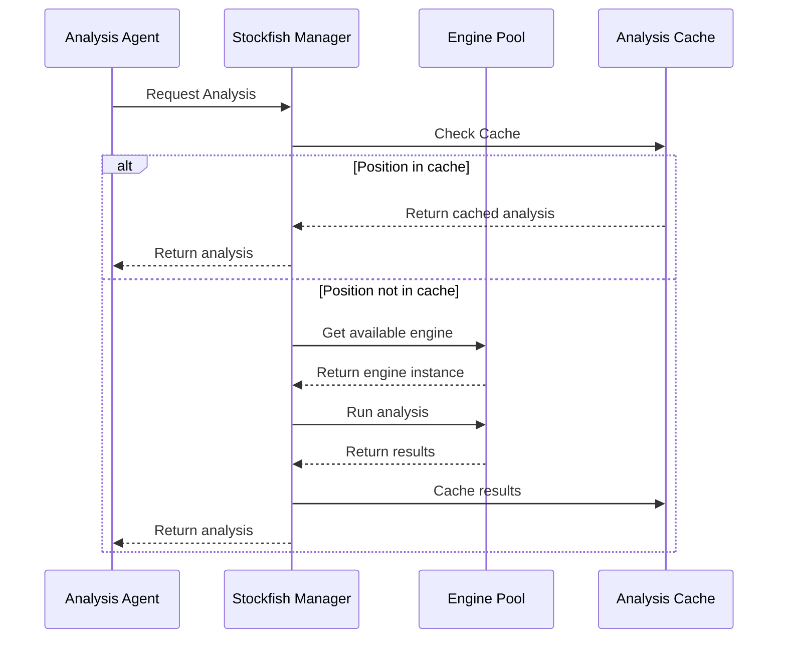

# Chess Tutor AI - Architectural Design Document

## 1. System Overview

The Chess Tutor AI is an intelligent teaching system that uses multiple specialized agents to analyze chess positions and provide instruction. Built with Pydantic-ai for structured AI interactions and LangGraph for agent orchestration, the system creates a comprehensive understanding of chess positions through multi-agent collaboration.

## 2. Core Architecture


## 3. Agent Specifications

### 3.1 Analysis Agents (Pydantic-ai Models)

```python
from pydantic_ai import AIModel, Field, LLMFunction

class TacticalAnalyzer(AIModel):
    """Agent responsible for tactical analysis"""
    position_fen: str = Field(..., description="FEN notation of the position")
    
    @LLMFunction
    def find_tactical_motifs(self) -> list[dict]:
        """Identify tactical themes and combinations"""
        
    @LLMFunction
    def calculate_critical_lines(self) -> list[dict]:
        """Calculate tactically critical variations"""

class StrategicEvaluator(AIModel):
    """Agent responsible for strategic evaluation"""
    position_fen: str = Field(..., description="FEN notation of the position")
    
    @LLMFunction
    def evaluate_pawn_structure(self) -> dict:
        """Analyze pawn structure and its implications"""
        
    @LLMFunction
    def assess_piece_placement(self) -> dict:
        """Evaluate piece placement and coordination"""
        
    @LLMFunction
    def identify_plans(self) -> list[dict]:
        """Identify strategic plans for both sides"""

class PatternRecognitionAgent(AIModel):
    """Agent for recognizing common patterns"""
    position_fen: str = Field(..., description="FEN notation of the position")
    
    @LLMFunction
    def identify_similar_positions(self) -> list[dict]:
        """Find similar historical positions"""
        
    @LLMFunction
    def suggest_typical_plans(self) -> list[dict]:
        """Suggest plans based on recognized patterns"""

class PieceCoordinationAgent(AIModel):
    """Agent for analyzing piece coordination"""
    position_fen: str = Field(..., description="FEN notation of the position")
    
    @LLMFunction
    def analyze_piece_synergy(self) -> dict:
        """Analyze how pieces work together"""
        
    @LLMFunction
    def find_improvement_spots(self) -> list[dict]:
        """Identify pieces that could be better placed"""
```

### 3.2 Teaching Agents (Pydantic-ai Models)

```python
class MoveExplainer(AIModel):
    """Agent for explaining moves"""
    move_uci: str
    position_analysis: dict = Field(..., description="Combined analysis from other agents")
    
    @LLMFunction
    def explain_move_reasoning(self) -> str:
        """Generate comprehensive move explanation"""
        
    @LLMFunction
    def suggest_alternatives(self) -> list[dict]:
        """Suggest and explain alternative moves"""

class ConceptTeacher(AIModel):
    """Agent for teaching chess concepts"""
    position_analysis: dict
    
    @LLMFunction
    def extract_teaching_points(self) -> list[dict]:
        """Extract key concepts for teaching"""
        
    @LLMFunction
    def generate_exercises(self) -> list[dict]:
        """Generate related exercises for practice"""

class ImprovementSuggester(AIModel):
    """Agent for suggesting improvements"""
    game_analysis: dict
    
    @LLMFunction
    def suggest_improvements(self) -> list[dict]:
        """Suggest concrete improvements"""
        
    @LLMFunction
    def create_study_plan(self) -> dict:
        """Create personalized study plan"""
```

## 4. Stockfish Integration

### 4.1 Core Components

```python
from pydantic_ai import AIModel, Field, LLMFunction
from typing import List, Dict, Optional

class StockfishConfig(AIModel):
    """Configuration for Stockfish engine"""
    depth: int = Field(20, description="Analysis depth")
    threads: int = Field(4, description="Number of CPU threads")
    hash_size: int = Field(128, description="Hash table size in MB")
    multi_pv: int = Field(3, description="Number of principal variations")

class EngineAnalysis(AIModel):
    """Structured engine analysis results"""
    evaluation: float
    best_moves: List[str]
    principal_variations: List[Dict]
    depth_reached: int
    nodes_searched: int
    time_spent_ms: int

class StockfishManager:
    """Manages Stockfish engine instances and analysis requests"""
    def __init__(self, config: StockfishConfig):
        self.config = config
        self.engine_pool = self._initialize_engine_pool()
        self.analysis_cache = {}
        self.position_queue = asyncio.Queue()

    async def get_analysis(self, fen: str, depth: Optional[int] = None) -> EngineAnalysis:
        """Get engine analysis for a position"""
        if fen in self.analysis_cache:
            return self.analysis_cache[fen]
            
        engine = await self._get_available_engine()
        try:
            analysis = await self._analyze_position(engine, fen, depth)
            self.analysis_cache[fen] = analysis
            return analysis
        finally:
            await self._release_engine(engine)
```

### 4.2 Analysis Pipeline



### 4.3 Parallel Analysis Implementation

```python
class AnalysisPipeline:
    """Coordinates parallel analysis requests"""
    def __init__(self, stockfish_manager: StockfishManager):
        self.stockfish = stockfish_manager
        
    async def run_parallel_analysis(
        self,
        position_fen: str,
        analysis_types: List[str]
    ) -> Dict:
        """Run multiple analysis tasks in parallel"""
        tasks = []
        
        if "tactical" in analysis_types:
            analyzer = TacticalAnalyzer(
                position_fen=position_fen,
                stockfish=self.stockfish
            )
            tasks.append(analyzer.find_tactical_motifs())
            
        if "strategic" in analysis_types:
            evaluator = StrategicEvaluator(
                position_fen=position_fen,
                stockfish=self.stockfish
            )
            tasks.append(evaluator.evaluate_position_features())
            
        # Run all analysis tasks concurrently
        results = await asyncio.gather(*tasks)
        return self._combine_analysis_results(results)
```

## 5. LangGraph Implementation

### 5.1 Agent Orchestration


### 5.2 State Handling

```python
class ChessTutorGraph(Graph):
    def __init__(self):
        self.agents = {
            'tactical': TacticalAnalyzer(),
            'strategic': StrategicEvaluator(),
            'patterns': PatternRecognitionAgent(),
            'coordination': PieceCoordinationAgent(),
            'explainer': MoveExplainer(),
            'teacher': ConceptTeacher(),
            'improver': ImprovementSuggester()
        }
        
    async def run_analysis(self, position_fen: str) -> dict:
        # Parallel analysis execution
        analysis_tasks = [
            self.agents['tactical'].find_tactical_motifs(),
            self.agents['strategic'].evaluate_pawn_structure(),
            self.agents['patterns'].identify_similar_positions(),
            self.agents['coordination'].analyze_piece_synergy()
        ]
        results = await asyncio.gather(*tasks)
        return self.combine_analysis_results(results)
```

## 6. Error Handling

```python
class EngineError(Exception):
    """Base class for engine-related errors"""
    pass

class AnalysisTimeout(EngineError):
    """Raised when analysis exceeds time limit"""
    pass

class EngineFailure(EngineError):
    """Raised when engine fails to respond"""
    pass

async def handle_engine_error(error: Exception, position_fen: str):
    """Handle engine-related errors gracefully"""
    if isinstance(error, AnalysisTimeout):
        # Fall back to cached or shallow analysis
        pass
    elif isinstance(error, EngineFailure):
        # Restart engine instance
        pass
```

## 7. Implementation Plan

### Phase 1: Core Components (Week 1-2)
1. Implement basic agent models
2. Set up Stockfish integration and engine pool
3. Create analysis pipeline

### Phase 2: Teaching Logic (Week 3-4)
1. Implement teaching agents
2. Build explanation system
3. Create feedback loop

### Phase 3: Integration (Week 5-6)
1. Implement LangGraph orchestration
2. Add error handling
3. Optimize agent interaction

### Phase 4: Testing (Week 7-8)
1. Unit tests for all components
2. Integration tests
3. Performance optimization
4. Teaching effectiveness evaluation

## 8. Directory Structure

```
chess_tutor/
├── agents/
│   ├── analysis/
│   │   ├── tactical.py
│   │   ├── strategic.py
│   │   ├── patterns.py
│   │   └── coordination.py
│   └── teaching/
│       ├── explainer.py
│       ├── teacher.py
│       └── improver.py
├── core/
│   ├── engine/
│   │   ├── stockfish.py
│   │   ├── manager.py
│   │   └── analysis.py
│   └── orchestrator.py
├── utils/
│   ├── chess_utils.py
│   └── analysis_utils.py
└── main.py
```

## 9. Technical Considerations

### 9.1 Performance
- Parallel agent execution
- Engine pool management
- Caching analysis results
- Adaptive analysis depth
- Early stopping for clear positions

### 9.2 Scalability
- Modular agent design
- Extensible analysis pipeline
- Dynamic engine pool scaling
- Configurable teaching strategies

### 9.3 Quality Assurance
- Unit tests for all components
- Integration tests
- Analysis validation
- Teaching effectiveness metrics
- Engine reliability monitoring

## 10. Implementation Tickets

### EPIC-1: Core Engine Integration
#### TASK-1.1: Stockfish Manager Setup
Priority: High
Dependencies: None
Description: Implement the core StockfishManager class for engine management

Subtasks:
1. Install and validate Stockfish binary
   - Set up Stockfish installation script
   - Add version validation
   - Create binary path configuration

2. Implement engine pool initialization
   - Create engine instance wrapper class
   - Implement thread-safe engine pool
   - Add configuration validation
   - Test pool creation/destruction

3. Create engine communication layer
   - Implement UCI protocol wrapper
   - Add command queuing system
   - Create response parser
   - Add timeout handling

4. Implement analysis cache
   - Design cache data structure
   - Add cache invalidation strategy
   - Implement thread-safe access
   - Add cache size limits

Acceptance Criteria:
- Stockfish binary is properly detected and validated
- Multiple engine instances can run concurrently
- Engine pool properly manages resources
- Cache effectively stores and retrieves analysis results

#### TASK-1.2: Analysis Pipeline Implementation
Priority: High
Dependencies: TASK-1.1
Description: Create the analysis pipeline for processing positions

Subtasks:
1. Implement position analysis queue
   - Create queue data structure
   - Add priority handling
   - Implement cancellation support

2. Create analysis result processor
   - Design result data structure
   - Implement PV parsing
   - Add evaluation normalization
   - Create error handling

3. Add parallel analysis support
   - Implement task distribution
   - Add result aggregation
   - Create load balancing
   - Test concurrent analysis

Acceptance Criteria:
- Positions can be queued for analysis
- Results are properly parsed and structured
- Multiple positions can be analyzed in parallel
- System handles errors gracefully

### EPIC-2: Analysis Agents
#### TASK-2.1: Tactical Analyzer Implementation
Priority: High
Dependencies: TASK-1.2
Description: Implement the TacticalAnalyzer agent

Subtasks:
1. Create base tactical analysis
   - Implement position evaluation
   - Add tactical pattern recognition
   - Create move scoring system

2. Implement tactical motif detection
   - Add pattern database
   - Implement pattern matching
   - Create explanation generation
   - Add confidence scoring

3. Add critical line calculation
   - Implement variation analysis
   - Add threat detection
   - Create tactical sequence validation

4. Create LLM integration
   - Implement prompt engineering
   - Add context management
   - Create response parsing
   - Test explanation quality

Acceptance Criteria:
- Accurately identifies tactical patterns
- Provides clear explanations of tactics
- Handles complex positions effectively
- Generates helpful learning points

#### TASK-2.2: Strategic Evaluator Implementation
Priority: High
Dependencies: TASK-1.2
Description: Implement the StrategicEvaluator agent

Subtasks:
1. Create pawn structure analysis
   - Implement pawn chain detection
   - Add weakness identification
   - Create structure evaluation

2. Implement piece placement analysis
   - Add piece coordination scoring
   - Implement square control analysis
   - Create mobility evaluation

3. Add strategic plan generation
   - Implement position understanding
   - Add plan formulation
   - Create explanation generation

Acceptance Criteria:
- Accurately evaluates pawn structures
- Identifies strategic themes
- Suggests reasonable plans
- Provides clear explanations

### EPIC-3: Teaching System
#### TASK-3.1: Move Explainer Implementation
Priority: Medium
Dependencies: TASK-2.1, TASK-2.2
Description: Implement the MoveExplainer agent

Subtasks:
1. Create move analysis system
   - Implement move quality evaluation
   - Add context understanding
   - Create explanation generation

2. Implement alternative move suggestion
   - Add candidate move selection
   - Implement comparison logic
   - Create explanation generation

3. Add teaching point extraction
   - Implement concept identification
   - Add difficulty assessment
   - Create learning point generation

Acceptance Criteria:
- Provides clear move explanations
- Suggests reasonable alternatives
- Identifies key learning points
- Adapts to user level

#### TASK-3.2: Concept Teacher Implementation
Priority: Medium
Dependencies: TASK-3.1
Description: Implement the ConceptTeacher agent

Subtasks:
1. Create concept database
   - Define concept hierarchy
   - Add example positions
   - Create difficulty ratings

2. Implement concept extraction
   - Add pattern recognition
   - Implement relevance scoring
   - Create explanation generation

3. Add exercise generation
   - Implement position modification
   - Add difficulty scaling
   - Create validation system

Acceptance Criteria:
- Accurately identifies relevant concepts
- Generates appropriate exercises
- Provides clear explanations
- Adapts difficulty appropriately

### EPIC-4: System Integration
#### TASK-4.1: LangGraph Orchestrator Implementation
Priority: High
Dependencies: TASK-2.1, TASK-2.2, TASK-3.1
Description: Implement the LangGraph orchestration system

Subtasks:
1. Create state machine implementation
   - Design state transitions
   - Implement event handling
   - Add error recovery

2. Add agent coordination
   - Implement message passing
   - Add result aggregation
   - Create parallel execution

3. Implement conversation management
   - Add context tracking
   - Implement history management
   - Create state persistence

Acceptance Criteria:
- Properly manages system state
- Coordinates agents effectively
- Handles errors gracefully
- Maintains conversation context

#### TASK-4.2: Error Handling Implementation
Priority: Medium
Dependencies: All previous tasks
Description: Implement comprehensive error handling

Subtasks:
1. Create error classification system
   - Define error types
   - Implement error detection
   - Add severity assessment

2. Implement recovery strategies
   - Add fallback mechanisms
   - Implement retry logic
   - Create state recovery

3. Add monitoring and logging
   - Implement error tracking
   - Add performance monitoring
   - Create alert system

Acceptance Criteria:
- Properly catches all errors
- Implements appropriate recovery
- Maintains system stability
- Provides useful error information

### EPIC-5: Testing and Optimization
#### TASK-5.1: Test Suite Implementation
Priority: High
Dependencies: All previous tasks
Description: Implement comprehensive test suite

Subtasks:
1. Create unit tests
   - Add component tests
   - Implement integration tests
   - Create performance tests

2. Implement position test suite
   - Add tactical positions
   - Implement strategic positions
   - Create endgame positions

3. Add teaching effectiveness tests
   - Implement explanation validation
   - Add concept coverage testing
   - Create user simulation

Acceptance Criteria:
- Achieves high test coverage
- Validates all components
- Ensures teaching quality
- Measures performance metrics

#### TASK-5.2: Performance Optimization
Priority: Medium
Dependencies: TASK-5.1
Description: Optimize system performance

Subtasks:
1. Implement caching optimization
   - Add cache warming
   - Implement prefetching
   - Create cache analytics

2. Add parallel processing optimization
   - Implement load balancing
   - Add resource management
   - Create performance monitoring

3. Optimize memory usage
   - Implement memory pooling
   - Add garbage collection
   - Create memory monitoring

Acceptance Criteria:
- Improves response times
- Reduces resource usage
- Handles concurrent users
- Maintains performance under load